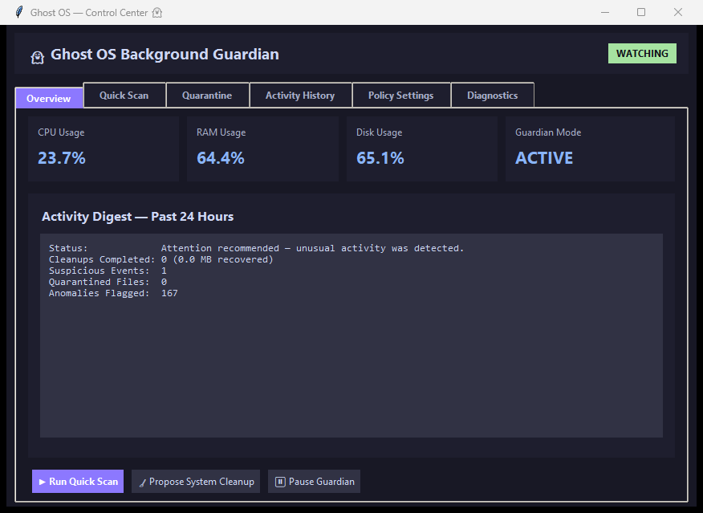

<div align="center">

#  Ghost OS

**A local-first Windows background guardian for system, file, and process monitoring.**

*Ghost watches silently. Ghost thinks before acting. Ghost acts safely. Ghost tells you what happened.*

</div>

<p align="center">
  
</p>

---

Ghost OS is a monitoring and system-guardian project — it is not a replacement for Windows Security / Microsoft Defender. It runs alongside your existing antivirus, adding behavioral observation, file hygiene, and safe cleanup on top.

Ghost OS runs quietly in your system tray, continuously watching CPU/RAM/disk activity, new files in Downloads/Desktop, and running processes. When it finds something worth your attention — a disguised executable, a real Defender detection, unusual resource behavior — it asks you what to do via a native Windows notification. It never deletes anything without your say-so.

---

## Table of Contents

- [Features](#features)
- [Architecture](#architecture)
- [Project Structure](#project-structure)
- [Requirements](#requirements)
- [Installation](#installation)
- [Configuration](#configuration)
- [The Safety Model](#the-safety-model)
- [Testing](#testing)
- [Building From Source](#building-from-source)
- [Design Goals](#design-goals)
- [Limitations](#limitations)
- [Contributing](#contributing)
- [Roadmap](#roadmap)
- [License](#license)

---

## Features

### 🖥️ System Monitoring
- Continuous CPU, RAM, disk, and network telemetry
- Persistent local history in SQLite — nothing leaves your machine
- Automatic retention cleanup (old telemetry ages out on a schedule)

### 📁 File Monitoring
- Watches Downloads, Desktop, and Temp for new or changed files
- Bounded worker-pool event handling (no thread-per-file explosion under heavy load)
- Disguised-extension detection (`invoice.pdf.exe`), stale installer/cache detection

### ⚙️ Process Monitoring
- Detects process creation and termination via snapshot diffing
- Flags suspicious parent/child spawn patterns
- Records process telemetry for heavy-hitter and anomaly analysis

### 🛡️ Threat Detection Pipeline
A layered, explainable pipeline — every score is traceable to a named signal, not a black box:

```text
File/Process Event → Rule Engine (risk scoring) → Windows Defender (real malware scan)
                                ↓
                         Decision Engine (severity → outcome)
                                ↓
                          Safety Engine (final gate)
```

- **Rule Engine** — explainable risk scoring (0–100) for disguised extensions, unusual script locations, stale clutter
- **Windows Defender integration** — shells out to `MpCmdRun.exe` for real malware scanning rather than reinventing an AV engine
- **Decision Engine** — maps severity (`LOW`/`MEDIUM`/`HIGH`/`CRITICAL`) to an outcome (`IGNORE`/`LOG`/`NOTIFY`/`ASK_USER`)
- **Safety Engine** — the final gate: protected process/path lists, dry-run mode, path-traversal validation — nothing destructive happens without clearing this first

###  Quarantine, Not Deletion
Flagged files are isolated into a local vault with SHA-256 integrity verification, fully restorable if a detection turns out to be a false positive.

###  Ask-First Notifications
Every real detection surfaces as a native Windows Action Center toast with **Quarantine / Leave it alone / View details** buttons. Nothing is auto-deleted. Notifications are cooldown-limited and aggregated so you're never spammed with repeats of the same signal.

###  Safe System Cleanup
Discover → preview → notify → execute → verify → log. Cleanup only ever touches known-disposable cache locations (Temp), never your personal files, and respects the same Safety Engine gate as everything else.

###  Native Control Center
A real Tkinter window (not a browser tab) for the moments you do want detail: live system status, Quick Scan with progress, Quarantine management with restore, Activity History, Policy Settings, and Diagnostics. Ghost OS is designed so you rarely need to open it.

###  Background-First
- Autostarts at login (unprivileged by default, least-privilege)
- System tray presence, same shelf as Windows Security / other background guardians
- Single-instance protected — a duplicate launch exits cleanly instead of running two guardians

---

## Architecture

```text
Ghost OS
   │
┌──┴──┐
│ GhostCore │
└──┬──┘
   │
┌────────────────────────┼────────────────────────┐
│                        │                        │
▼                        ▼                        ▼
System Monitor      File Watcher          Process Watcher
│                        │                        │
└────────────────────────┼────────────────────────┘
                         ▼
        Threat Sentinel (Rule Engine + Defender)
                         │
                         ▼
                  Decision Engine
                         │
                         ▼
                   Safety Engine
                         │
       ┌─────────────────┼─────────────────┐
       ▼                 ▼                 ▼
   Quarantine         Cleaner        Notifications
                                     (native toast)
       └─────────────────┬─────────────────┘
                         ▼
         SQLite (guardian_events, quarantine_log, telemetry)
```

The separation is deliberate: **observation → analysis → decision → action**. No subsystem skips the chain — a detection can't reach a destructive action without passing through the Decision Engine and Safety Engine first.

---

## Project Structure

```text
Ghost-OS/
├── assets/                  # Icons and branding
├── config/
│   └── policy.yaml          # Validated at startup — bad config fails loudly, not silently
├── installer/
│   ├── ghost_os_setup.iss   # Inno Setup script
│   └── build_installer.py
├── src/
│   ├── core/                # GhostCore orchestrator, config loader, logger, single-instance guard
│   ├── sensors/             # System telemetry (CPU/RAM/disk/network)
│   ├── processes/           # Process enumeration and heavy-hitter detection
│   ├── watchers/            # File watcher (bounded queue) + process watcher (diffing)
│   ├── intelligence/        # Rule engine, Defender scanner, threat sentinel, anomaly detector
│   ├── decision/            # Decision engine (severity → outcome), Safety engine (final gate)
│   ├── actions/             # Cleaner, quarantine manager, scan job, diagnostics job
│   ├── actuators/           # RAM trimming, process priority governance
│   ├── notifications/       # Native Windows toast notifications (cooldown + aggregation)
│   ├── tray/                # System tray icon and menu
│   ├── ui/                  # Native Control Center (Tkinter)
│   ├── autostart/           # Windows autostart registration
│   └── database/            # SQLite persistence layer
├── tests/                   # pytest suite — lifecycle, safety, rule engine, stress tests
├── build_package.py         # PyInstaller build script
├── ghost_os_main.py         # Entrypoint
├── requirements.txt
└── README.md
```

---

## Requirements

- **Runtime (end users)**: Windows 10/11, 64-bit. Nothing else — the installer/portable build is self-contained.
- **Development**:
  - Python 3.11+
  - Windows Defender / Microsoft Defender (for Defender-backed scanning)
  - [Inno Setup 6](https://jrsoftware.org/isinfo.php) (only needed to build the installer)

---

## Installation

### Recommended — Windows Installer

The primary distribution is `GhostOS-Setup.exe`. No Python, no terminal, no manual file copying.

1. Download `GhostOS-Setup.exe` from the latest release.
2. Run it and follow the setup wizard.
3. The installer configures:
   - Application binaries in `%LOCALAPPDATA%\Programs\Ghost OS\`
   - Start Menu shortcut (with a registered `AppUserModelID`, so notifications render correctly)
   - Optional desktop shortcut
   - Optional autostart at login
   - Isolated runtime data in `%LOCALAPPDATA%\GhostOS\`
   - A Windows Uninstaller entry in Settings

### Portable Archive

For environments without install privileges: download `GhostOS-portable.zip`, extract, and run `GhostOS.exe` directly.

### Developer Setup (Run From Source)

```powershell
git clone https://github.com/bk5859200-blip/Ghost-OS.git
cd Ghost-OS
python -m venv venv
venv\Scripts\Activate.ps1
pip install -r requirements.txt
python ghost_os_main.py
```

For a windowless background launch:
```powershell
pythonw ghost_os_main.py
```

---

## Configuration

Default policy lives at `config/policy.yaml` and is validated at startup — an invalid value fails startup loudly rather than silently falling back to a guess. Key sections:

| Section | Controls |
| :--- | :--- |
| `monitoring` | Polling intervals, telemetry retention |
| `thresholds` | CPU/RAM/disk warning and critical levels |
| `notifications` | Cooldown and aggregation windows |
| `watch_folders` | Which folders the file watcher covers |
| `cleanup` | Stale-file age thresholds, confirmation requirement |
| `security` | Protected process/path lists — Ghost will never act on these regardless of resource usage |
| `safety` | `dry_run` — on by default |

Runtime data (never committed to git, never bundled with the app) lives separately under `%LOCALAPPDATA%\GhostOS\`:

```text
GhostOS/
├── config/policy.yaml       (installed user copy)
├── data/
│   ├── telemetry.db
│   └── quarantine/
└── logs/ghost_os.log
```

---

## The Safety Model

```text
Detection → Decision Engine → Safety Engine → Action
```

- **`dry_run: true` by default**. Ghost detects, scores, and notifies exactly as it normally would — it just won't actually delete or quarantine anything until you turn this off.
- **Nothing destructive happens without `ASK_USER`**. Quarantine and delete both require your explicit response to a notification.
- **Protected processes and paths are hard-coded exclusions**, checked before any action — high resource usage alone is never sufficient justification to act on something.
- **Unknown ≠ malicious**. Nothing escalates to a user-facing alert without an actual signal (a rule-engine score or a real Defender detection) behind it.

---

## Testing

```powershell
pip install pytest
pytest tests/ -v
```

Coverage includes configuration validation, database management, system/process/file monitoring, the threat-detection pipeline, decision and safety logic, quarantine (including restore integrity via hash verification), notifications, single-instance behavior, thread-lifecycle stability, and event-storm stress tests.

Release-specific runtime validation is documented in `FINAL_VALIDATION.md` and `RELEASE_VALIDATION.md`.

---

## Building From Source

Standalone executable:
```powershell
python build_package.py
```
*Output: `dist/GhostOS/GhostOS.exe`*

Windows installer (requires Inno Setup 6):
```powershell
python installer/build_installer.py
```
*Output: `dist/GhostOS-Setup.exe`*

---

## Design Goals

- **Local-first** — telemetry and application data never leave your machine
- **Safety-first** — every system action is gated through explicit, auditable safety controls
- **Background-first** — you should rarely need to open a window for this to be useful
- **Modular** — monitoring, intelligence, decision-making, actions, and persistence are cleanly separated
- **Observable** — every meaningful action is logged so a problem can be investigated, never silently ignored
- **Lightweight** — a system guardian that becomes the resource problem it's meant to catch has failed at its one job

---

## Limitations

Ghost OS is not a complete antivirus or endpoint-security solution. Its detection depends on configured rules, available system information, and Windows Defender integration — it complements Defender, it doesn't replace it. Keep Windows Security enabled and your definitions current.

---

## Contributing

Before submitting changes:
1. Keep changes focused and scoped.
2. Never bypass the Safety Engine — any code path that deletes, moves, or terminates something must go through it.
3. Add or update tests for behavioral changes.
4. Run the full test suite (`pytest tests/ -v`).
5. Verify background threads terminate cleanly on pause/stop.
6. Keep runtime data outside the installation directory.

---

## Roadmap

- Per-process behavioral baselining (learned-normal CPU/RAM ranges, not just global thresholds)
- Digital signature verification as an additional risk signal
- Startup-program auditing (persistence-technique detection)
- Richer "what happened while you were away" activity digest
- Live telemetry graphs in the Control Center Overview tab

---

## License

This project is currently under active development. License terms will be finalized and added here.

---

<div align="center">

*Ghost OS — a quiet system guardian, not a chatbot.*

[Report an issue](https://github.com/bk5859200-blip/Ghost-OS/issues) · Author: [Bhargava Krishna](https://github.com/bk5859200-blip)

</div>
