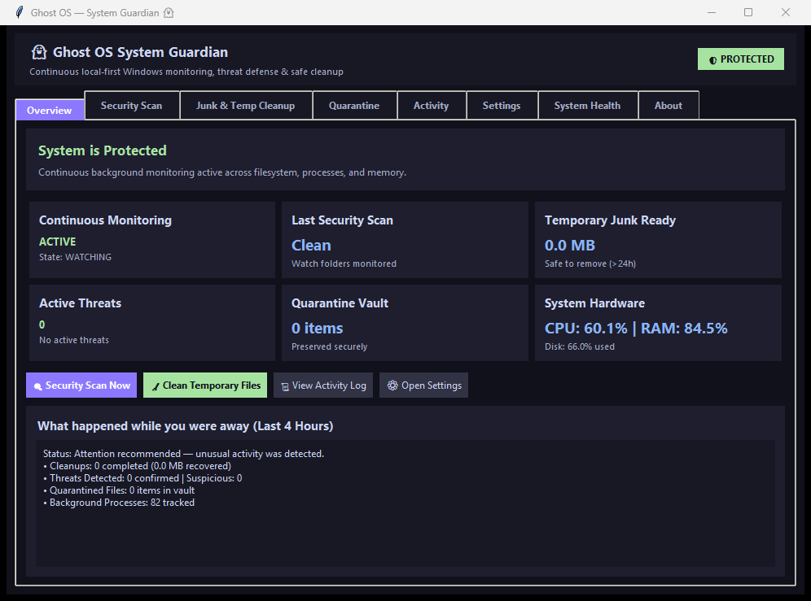

<div align="center">

# 🛡️ Ghost OS

### A lightweight Windows background guardian for threat detection, system monitoring, quarantine, and safe temporary-file cleanup.

[](https://microsoft.com/windows)
[](https://python.org)
[](https://pytest.org)
[](https://github.com/bk5859200-blip/Ghost-OS)
[](#-security-model)

<br/>

<p align="center">
  
</p>

*Ghost OS Native Control Center — Real-time security status, 8 standardized management tabs, multi-signal threat visibility, quarantine vault, junk & temp cleanup, and subsystem diagnostics.*

</div>

---

Ghost OS is an open-source, local-first background security guardian and system maintenance application designed specifically for Windows. It operates silently in the background alongside your primary antivirus (such as Microsoft Defender), adding continuous behavioral observation, multi-signal threat detection, an isolated quarantine vault, and automated stale temporary-file cleanup — without disrupting everyday desktop usage.

Ghost OS is designed for explainability and local operation. Every risk assessment is mapped to observable signals (Authenticode digital signatures, publisher reputation, Defender CLI scans, naming anomalies, and behavioral diffs). Core monitoring, telemetry logging, and security operations execute locally on your machine, avoiding abrupt process termination during cleanup and gating destructive actions behind explicit authorization and safety controls.

---

## ⚡ Quick Value Proposition

* **🛡️ Continuous Background Monitoring** — Watches watch folders (`Downloads`, `Desktop`, `Temp`), monitors running processes, and tracks live CPU, RAM, and Disk metrics.
* **🔍 Explainable Threat Detection** — Combines local rule heuristics, Microsoft Defender (`MpCmdRun.exe`), and Authenticode verification to evaluate risk scores (0–100).
* **🎯 5-Tier Risk Classification** — Strictly separates `CLEAN`, `LOW_RISK`, `SUSPICIOUS`, `THREAT`, and `CONFIRMED_MALWARE` so ordinary downloads (e.g. Spotify, Python installers) are never mislabeled as malware.
* **🗃️ Quarantine Vault** — Safely isolates suspicious files into a secure vault with SHA-256 hash verification and original-path restoration.
* **🧹 Windows Temp & Junk Cleaner** — Safely discovers and removes stale temporary files (`>24h`) across `%TEMP%`, `%TMP%`, `%WINDIR%\Temp`, and `%LOCALAPPDATA%\CrashDumps` without killing active processes.
* **🔔 Actionable Windows Notifications** — Native Windows Action Center toast alerts with interactive action buttons (`Quarantine`, `Leave it alone`, `View details`).
* **🖥️ Native Desktop Control Center** — Responsive dark-themed Tkinter desktop interface with 8 dedicated management tabs.
* **🔒 SafetyEngine Protection** — Authoritative safety gate that strictly protects Windows system directories (`C:\Windows\System32`), critical system processes (`lsass.exe`, `explorer.exe`), and enforces `dry_run` mode.
* **📊 Local SQLite Telemetry** — Persistent audit logging of security detections, process lifecycles, and cleanup operations stored locally on disk.
* **📦 Production Packaging** — Clean PyInstaller standalone executable (`GhostOS.exe`) and Inno Setup installer (`GhostOS-Setup.exe`).

---

## 📑 Table of Contents

- [Core Subsystems & Features](#-core-subsystems--features)
  - [Continuous Guardian](#1--continuous-guardian)
  - [Threat Detection Pipeline](#2--threat-detection-pipeline)
  - [Context-Aware Risk Classification](#3--context-aware-risk-classification)
  - [Quarantine Vault](#4--quarantine-vault)
  - [Windows Temp & Junk Cleaner](#5--windows-temp--junk-cleaner)
  - [Windows Action Center Notifications](#6--windows-action-center-notifications)
  - [Native Control Center](#7--native-control-center)
- [Security & Safety Model](#-security-model)
- [System Architecture](#-system-architecture)
- [Tech Stack](#-tech-stack)
- [Installation & Quickstart](#-installation)
- [Developer Setup](#-developer-setup)
- [Automated Testing](#-testing)
- [Build & Packaging](#-building)
- [Project Structure](#-project-structure)
- [Configuration](#-configuration)
- [Windows Startup](#-windows-startup)
- [Privacy & Local-First Design](#-privacy--local-first-design)
- [Limitations](#-limitations)
- [Roadmap](#-roadmap)
- [Contributing](#-contributing)
- [License](#-license)

---

## 🚀 Core Subsystems & Features

### 1. 🛡️ Continuous Guardian
Ghost OS runs continuously as a lightweight background service with minimal resource overhead (~0.1% CPU at idle):
* **File System Watcher**: Monitors configured watch roots (`%USERPROFILE%\Downloads`, `%USERPROFILE%\Desktop`, `%TEMP%`) for file creation and modification using event debouncing and a bounded worker thread pool.
* **Process Watcher**: Performs periodic process snapshot diffing to detect newly spawned processes and inspect parent/child relationships without hooking into kernel space.
* **System Telemetry**: Samples CPU usage, RAM utilization, disk consumption, and IO throughput every 2 seconds, recording smoothed metrics in SQLite.
* **Single-Instance Enforcement**: Utilizes a Windows named mutex (`Global\GhostOS_SingleInstance_Mutex`) to guarantee that only one guardian instance runs simultaneously.
* **Pause / Resume Lifecycle**: Allows instant temporary pausing of all background watchers directly from the tray icon or the Control Center.

---

### 2. 🔍 Threat Detection Pipeline
Every file event or manual scan request flows through a multi-stage evaluation pipeline:

```text
       File / Process Event
                │
                ▼
        [ Threat Sentinel ]
                │
   ┌────────────┴────────────┐
   ▼                         ▼
[ Rule Engine ]      [ Defender Scanner ]
(Signatures & Names)  (MpCmdRun.exe CLI)
   │                         │
   └────────────┬────────────┘
                ▼
      [ Anomaly Detector ]
                │
                ▼
      [ Decision Engine ]
 (Maps Score & Category to 5-Tier Level)
                │
                ▼
       [ Safety Engine ]
 (Protected Paths & dry_run Policy)
                │
                ▼
  [ Action: LOG / NOTIFY / QUARANTINE ]
```

1. **Threat Sentinel**: Coordinates analysis workers with bounded concurrency semaphores to prevent CPU starvation.
2. **Rule Engine**: Analyzes Authenticode digital signatures, verified publisher metadata, disguised double-extensions (e.g. `invoice.pdf.exe`), script execution in unusual folders, and entropy.
3. **Defender Scanner**: Offloads real-time antimalware signature scanning directly to Microsoft Defender via `MpCmdRun.exe` without spawning visible command prompt windows.
4. **Decision Engine**: Synthesizes rule heuristic scores (0–100) and Defender scan outcomes into an explainable verdict.
5. **Safety Engine**: Authoritative gatekeeper verifying that target paths are not protected system roots before permitting any quarantine or deletion.

---

### 3. 🎯 Context-Aware Risk Classification
Ghost OS enforces a strict 5-tier classification hierarchy to eliminate alarm fatigue. A newly downloaded installer or unsigned utility is never branded as malware without definitive indicators:

| Classification | Criteria | Action Taken | User Prompt |
| :--- | :--- | :--- | :--- |
| **`CLEAN`** | Score 0–19. Verified digital signature, benign location, clean Defender scan. | Logged silently in telemetry (`LOG`) | None |
| **`LOW_RISK`** | Score 20–39. Unsigned executable, newly downloaded installer in `Downloads`. | Logged silently in telemetry (`LOG`) | None |
| **`SUSPICIOUS`** | Score 40–59. Disguised double-extension, executable in temp directory, anomaly signals. | Logged, elevated for review (`NOTIFY`) | Action Center notification (`NOTIFY`) |
| **`THREAT`** | Score 60–79. Script execution in hidden folder, multiple high-risk indicators. | Action recommended (`ASK_USER`) | High-priority notification (`ASK_USER`) |
| **`CONFIRMED_MALWARE`**| Score 80–100 or Microsoft Defender confirmed detection (`DEFENDER_THREAT`). | Immediate user alert / quarantine (`ASK_USER`) | Critical security alert popup / toast |

---

### 4. 🗃️ Quarantine Vault
* **Isolated Storage**: Suspicious files are moved out of their original directories into a secure quarantine repository (`data/quarantine/`).
* **SHA-256 Integrity Verification**: Calculates and records the cryptographic hash before and after quarantine.
* **Safe Restoration**: Restoring an item recalculates its SHA-256 hash to guarantee that the file was not altered in quarantine before returning it to its exact original path.
* **Database Tracking**: All quarantine events, timestamps, original locations, and resolution statuses are tracked in SQLite.

---

### 5. 🧹 Windows Temp & Junk Cleaner
Ghost OS includes a dedicated Windows temporary-file cleanup system designed for safe, routine disk recovery:

```text
Resolve %TEMP%, %TMP%, %WINDIR%\Temp, %LOCALAPPDATA%\CrashDumps
                        │
                        ▼
            Inspect File Age (>24 Hours)
                        │
        ┌───────────────┴───────────────┐
        ▼                               ▼
 [ Age < 24 Hours ]            [ Age >= 24 Hours ]
(Active: Preserved)           (Stale: Cleanup Candidate)
                                        │
                                        ▼
                            [ Safety Engine Gating ]
                                        │
                                        ▼
                            [ Non-Destructive Delete ]
                       (PermissionError / In-Use -> Skipped)
                                        │
                                        ▼
                       [ Prune Empty Subdirectories ]
                                        │
                                        ▼
                           [ Log Telemetry to DB ]
```

* **Target Locations**: Dynamically targets User Temp (`%TEMP%` / `%TMP%`), Windows System Temp (`%WINDIR%\Temp`), and Application Crash Dumps (`%LOCALAPPDATA%\CrashDumps`).
* **Age Threshold Filter**: Skips any temporary file modified within the last 24 hours to prevent interfering with active application installers or running background sessions.
* **Locked File Resilience**: Handles `PermissionError` and `OSError` without force-terminating running processes; locked files are safely bypassed and recorded.
* **Empty Directory Pruning**: Cleans leftover empty subdirectories inside temporary folders while strictly preserving the root directory itself.
* **Dry-Run Safety**: In default policy configuration, cleanup runs in `dry_run` simulation mode to display proposed space recovery safely before live deletions.
* **Clean Separation**: Cleanup is strictly a storage hygiene feature and is never routed through threat detection pipelines.

---

### 6. 🔔 Windows Action Center Notifications
* **Native Toast Integration**: Dispatches native Windows 10 and 11 toast notifications via the Windows Notification Subsystem (`windows_toasts`).
* **Interactive Quick Actions**: Security toasts provide inline buttons allowing users to `Quarantine`, `Leave it alone`, or `View details`. If toast display is unavailable, an in-app security alert dialog is presented as a fallback.
* **Anti-Spam Suppression**: Features configurable cooldown timers (`cooldown_seconds: 120`) and aggregation windows (`aggregate_window_seconds: 300`) to prevent duplicate notification storms.

---

### 7. 🖥️ Native Control Center
A native, dark-themed Tkinter desktop interface structured into 8 standardized management tabs:

| Tab Name | Functionality |
| :--- | :--- |
| **Overview** | Real-time system protection status badge, continuous monitoring state (`WATCHING`), metric cards (Threats, Quarantine, Cleanup candidates, CPU/RAM/Disk gauges), quick action buttons, and 4-hour away digest. |
| **Security Scan** | On-demand threat scanning across watch folders with real-time file progress, risk score badges (0–100), findings table with classification breakdown, and one-click quarantine actions. |
| **Junk & Temp Cleanup** | Safe candidate discovery across `%TEMP%`, `%TMP%`, `%WINDIR%\Temp`, and `%LOCALAPPDATA%\CrashDumps`, categorized candidate treeview (`SAFE TO CLEAN`, `IN USE`, `TOO RECENT`, `PROTECTED`, `SKIPPED`), item selection, and space recovery metrics. |
| **Quarantine** | Isolated vault table displaying original locations, detection reasons, severity, timestamps, SHA-256 cryptographic hashes, and safe file restoration or permanent deletion. |
| **Activity** | Searchable and categorized audit trail of security events, process spawns, cleanup runs, and system logs filterable by `ALL`, `SECURITY`, `CLEANUP`, `QUARANTINE`, `SYSTEM`, and `ERRORS`. |
| **Settings** | User-friendly form controls for Monitoring, Threat Detection, Junk & Temp Cleanup, Safety & Protection, Windows Startup, plus an Advanced raw YAML policy editor with schema validation. |
| **System Health** | Comprehensive 10-subsystem diagnostic health checklist with pass/warning/fail badges, execution latency, human-readable explanations, and non-blocking background execution. |
| **About** | Application release version, architecture notes, local database path, active guardian mode, safety rules, and project metadata. |

---

## 🔐 Security Model

Ghost OS adheres to 10 foundational security principles:

1. **Multi-Signal Context Over Single Heuristics**: A single factor (such as being unsigned or located in Downloads) is never treated as confirmed malware.
2. **Defender Independence & Collaboration**: Microsoft Defender scan results are treated as authoritative signals alongside local behavioral heuristics without replacing antivirus engines.
3. **SafetyEngine Protected Boundaries**: Critical system directories (`C:\Windows`, `C:\Program Files`) and essential Windows processes (`explorer.exe`, `lsass.exe`, `csrss.exe`, `MsMpEng.exe`) are hard-coded as immutable and cannot be deleted or killed.
4. **Isolated Cleanup Pipeline**: Temporary file cleanup and malware detection are completely decoupled.
5. **No Forceful Process Termination During Cleanup**: If a temporary file is in use by a process, Ghost OS skips the file cleanly instead of terminating the process.
6. **Explicit User Authorization**: Destructive operations require explicit confirmation through interactive toast buttons or Control Center dialogs.
7. **Safe Dry-Run Default**: `policy.yaml` enables `safety.dry_run: true` by default so users can evaluate actions safely before live modifications.
8. **Zero Console Flashing**: All background process calls (`MpCmdRun.exe`, PowerShell, Explorer) utilize `CREATE_NO_WINDOW` and hidden process creation flags to eliminate command prompt popups.
9. **Local Data Storage**: Telemetry, events, and metrics are written to a local SQLite database (`data/telemetry.db`).
10. **Defensive Scope**: Ghost OS is designed for endpoint observation, user alerting, and system maintenance. It does not install kernel filter drivers or intercept raw network packets.

---

## 🏗️ System Architecture

```text
ghost_os_main.py (SingleInstance Guard & Startup Bootstrap)
      │
      ▼
   GhostCore (Central Subsystem Coordinator)
      │
      ├── Sensors & Watchers
      │     ├── SystemSensor (psutil CPU, RAM, Disk, IO sampling)
      │     ├── FileWatcher (watchdog file event monitor + thread pool)
      │     └── ProcessWatcher (Snapshot diffing & spawn inspection)
      │
      ├── Intelligence & Detection
      │     ├── ThreatSentinel (Bounded concurrency coordinator)
      │     ├── RuleEngine (Heuristics, extensions, digital signatures)
      │     ├── DefenderScanner (MpCmdRun.exe background scanner)
      │     └── AnomalyDetector (Scikit-learn Isolation Forest)
      │
      ├── Decision & Policy Gate
      │     ├── DecisionEngine (Risk scoring & action mapping)
      │     └── SafetyEngine (Protected paths, system processes, dry_run)
      │
      ├── Actions & Storage
      │     ├── SystemCleaner (Safe Windows temp/junk cleanup pipeline)
      │     ├── QuarantineManager (Vault isolation & SHA-256 restore)
      │     ├── Notifier (Native Windows Action Center toasts)
      │     └── DBManager (SQLite persistent audit logging & metrics)
      │
      └── User Interface
            ├── TrayApp (System tray presence & menu actions)
            └── ControlCenterManager / ControlCenterApp (Tkinter Native UI)
```

---

## 🛠️ Tech Stack

| Layer | Technology | Purpose |
| :--- | :--- | :--- |
| **Language** | Python 3.10+ | Core runtime and engine logic |
| **User Interface** | Tkinter / ttk | Native Windows dark-themed Control Center |
| **System Tray** | `pystray` + `Pillow` | Background presence and tray icon actions |
| **File Monitoring** | `watchdog` | Filesystem event monitoring across watch roots |
| **Process & Metrics** | `psutil` + `pywin32` | Process snapshotting and CPU/RAM/Disk metrics |
| **Security Scanning** | Microsoft Defender CLI | Native malware scanning via `MpCmdRun.exe` |
| **Digital Signatures**| Windows Authenticode (`WinVerifyTrust` / `certutil`) | Publisher and signature verification |
| **Notifications** | `windows_toasts` | Native Windows 10/11 Action Center toasts |
| **Database** | SQLite3 | Local storage for events, history, and telemetry |
| **Configuration** | `ruamel.yaml` | Policy configuration with schema validation |
| **Packaging** | PyInstaller 6.x | Standalone one-dir Windows binary |
| **Installer** | Inno Setup 6.x | Windows setup installer with autostart options |
| **Testing** | `pytest` | Comprehensive unit and integration test suite |

---

## 📥 Installation

### Option 1: Windows Installer (Recommended)
1. Download the latest `GhostOS-Setup.exe` from [GitHub Releases](https://github.com/bk5859200-blip/Ghost-OS/releases).
2. Run the installer wizard and choose your preferred installation path and startup options.
3. Launch **Ghost OS** from the Start Menu or Desktop shortcut. The Control Center opens automatically, and the guardian begins background monitoring immediately.

### Option 2: Portable Archive
1. Download `GhostOS-portable.zip` from [GitHub Releases](https://github.com/bk5859200-blip/Ghost-OS/releases).
2. Extract the archive to any directory on your system.
3. Run `GhostOS.exe`.

> [!NOTE]
> Release packages are provided through GitHub Releases when published. For building from source, see [Developer Setup](#-developer-setup).

---

## 🧑‍💻 Developer Setup

### Prerequisites
* Windows 10 or Windows 11 (x64)
* Python 3.10, 3.11, 3.12, 3.13, or 3.14
* Git for Windows

### Step-by-Step Setup

```powershell
# 1. Clone the repository
git clone https://github.com/bk5859200-blip/Ghost-OS.git
cd "Ghost-OS"

# 2. Create and activate a Python virtual environment
python -m venv venv
.\venv\Scripts\Activate.ps1

# 3. Install required dependencies
pip install -r requirements.txt

# 4. Run Ghost OS in development mode
python ghost_os_main.py
```

---

## 🧪 Testing

Ghost OS includes an automated test suite covering unit tests, thread safety, process monitoring, quarantine integrity, 5-tier threat classification fixtures, cleanup safety, and Control Center UI instantiation:

```powershell
# Run the complete test suite with verbose output
pytest tests/ -v
```

```text
======================= 108 passed in 88.60s (0:01:28) ========================
```

* **Current automated test validation**: 108 tests passing.
* **Cleaner Unit Tests** (`tests/test_cleaner.py`): Verifies dynamic root discovery, age filtering (>24h vs new), locked-file resilience, empty directory pruning, and dry-run execution.
* **Threat Classification Acceptance Tests** (`tests/test_threat_distinction_acceptance.py`): Tests 7 real-world fixtures to verify that clean and unsigned software are never flagged as confirmed malware.
* **Pipeline Integration Tests** (`tests/test_integration_pipeline.py`): Validates file arrival -> Threat Sentinel -> Decision Engine -> Quarantine -> SHA-256 restore -> DB logging.
* **UI Tests** (`tests/test_ui.py`): Validates Control Center instantiation, tab switching, and hide-to-tray lifecycle.

> [!NOTE]
> Automated unit and integration tests run in isolated environments to test logic correctness. Live Windows runtime behavior across various operating system configurations is evaluated separately during release testing.

---

## 📦 Building

Ghost OS provides a dedicated build pipeline to produce standalone executables and Inno Setup installers:

### 1. Build Standalone Executable & Portable Zip
```powershell
python build_package.py
```
This script cleans stale artifacts, runs PyInstaller with all required hidden imports and version metadata, generates `dist/GhostOS/GhostOS.exe`, builds `dist/GhostOS-portable.zip`, computes SHA-256 checksums, and creates `dist/release_manifest.json`.

### 2. Compile Inno Setup Windows Installer
```powershell
python installer/build_installer.py
```
This script locates `ISCC.exe` (Inno Setup 6 compiler), compiles `installer/ghost_os_setup.iss`, and generates `dist/GhostOS-Setup.exe`.

---

## 📁 Project Structure

```text
Ghost-OS/
├── assets/                       # Application icons, logos, and UI screenshots
│   ├── ghost_os.ico
│   ├── ghost_os.png
│   └── screenshot_overview.png
├── config/                       # Configuration templates
│   └── policy.yaml               # Authoritative guardian policy configuration
├── installer/                    # Inno Setup installer definitions
│   ├── build_installer.py        # Automated ISCC compilation script
│   └── ghost_os_setup.iss        # Inno Setup installer script
├── src/                          # Application source code
│   ├── actions/                  # Cleanup, quarantine, scan, and diagnostics jobs
│   │   ├── cleaner.py            # Windows Temp & Junk Cleaner engine
│   │   ├── diagnostics_job.py    # Subsystem diagnostics evaluation
│   │   ├── quarantine_manager.py # Vault isolation & SHA-256 verification
│   │   └── scan_job.py           # On-demand multi-folder scanner
│   ├── actuators/                # Memory and disk actuation helpers
│   ├── autostart/                # Windows Registry autostart manager
│   ├── core/                     # Core runtime, config loader, logger, and lifecycle
│   │   ├── config_loader.py      # Schema-validated policy loader
│   │   ├── ghost_core.py         # Central coordinator
│   │   ├── path_manager.py       # Safe path resolver
│   │   ├── proc_utils.py         # Console-less hidden process execution
│   │   └── single_instance.py    # Windows Named Mutex single-instance guard
│   ├── database/                 # SQLite manager and schema migrations
│   │   └── db_manager.py
│   ├── decision/                 # Risk synthesis and safety enforcement
│   │   ├── decision_engine.py    # Multi-signal risk synthesis & mapping
│   │   └── safety_engine.py      # Protected paths, process guards, & dry-run
│   ├── intelligence/             # Threat inspection and scoring engines
│   │   ├── anomaly_detector.py   # Machine learning isolation forest
│   │   ├── defender_scanner.py   # Microsoft Defender MpCmdRun CLI integration
│   │   ├── rule_engine.py        # Explainable heuristic risk scoring
│   │   ├── signature_verifier.py # Authenticode digital signature verifier
│   │   └── threat_sentinel.py    # Inspection worker coordinator
│   ├── notifications/            # Windows Action Center toast notifications
│   │   └── notifier.py
│   ├── processes/                # Process snapshotting and anomaly analysis
│   ├── sensors/                  # System resource telemetry collector
│   ├── tray/                     # System tray application and menus
│   │   └── tray_app.py
│   ├── ui/                       # Native Tkinter Control Center
│   │   └── control_center.py     # 8-tab Control Center UI & dialogs
│   └── watchers/                 # Filesystem and process monitors
├── tests/                        # Automated pytest test suite (108 tests)
├── build_package.py              # PyInstaller packaging automation script
├── ghost_os_main.py              # Application entry point
├── requirements.txt              # Production and development dependencies
├── version_info.txt              # Windows binary version resource metadata
└── README.md                     # Project documentation
```

---

## ⚙️ Configuration

Ghost OS is configured via `config/policy.yaml`. The configuration is strictly validated against a schema at startup:

```yaml
ghost:
  startup: true                   # Enable/disable Windows login autostart

monitoring:
  system_interval_seconds: 2      # Telemetry polling interval (seconds)
  process_interval_seconds: 5     # Process snapshot diffing interval (seconds)
  db_cleanup_days: 7              # SQLite telemetry retention window (days)

thresholds:
  cpu:
    critical_percent: 92.0
    consecutive_ticks: 3
  memory:
    critical_percent: 95.0
  disk:
    warning_percent: 90.0

notifications:
  enabled: true
  cooldown_seconds: 120           # Minimum cooldown between identical notifications
  aggregate_window_seconds: 300   # Repeated events grouped in time window

watch_folders:
  - "%USERPROFILE%\\Downloads"
  - "%USERPROFILE%\\Desktop"
  - "%TEMP%"

cleanup:
  enabled: true
  require_confirmation: true      # Propose cleanup via notification instead of silent execution
  stale_installer_days: 30
  stale_temp_days: 14

security:
  behavioral_monitoring: true
  protected_processes:
    - "explorer.exe"
    - "winlogon.exe"
    - "csrss.exe"
    - "MsMpEng.exe"               # Microsoft Defender
    - "python.exe"
  protected_paths:
    - "C:\\Windows"
    - "C:\\Program Files"
    - "C:\\Program Files (x86)"

safety:
  dry_run: true                   # Default ON: simulate actions without modifying disk
```

---

## 🪟 Windows Startup

When configured with `ghost.startup: true`, Ghost OS registers itself with Windows via the Current User Run Key:

$$\text{HKCU}\\Software\\Microsoft\\Windows\\CurrentVersion\\Run$$

* **Unprivileged Execution**: Runs under standard user privileges without requiring UAC elevation at startup.
* **Seamless Boot Lifecycle**: Ghost OS initializes silently, starts background monitoring workers, docks in the system tray, and presents the Control Center window.

---

## 🔒 Privacy & Local-First Design

Ghost OS is designed with local-first privacy in mind:
* **Local Operation**: Core monitoring, telemetry logging, and threat scoring execute locally on your machine.
* **Local Database Storage**: Monitoring events, process history, and metrics are stored locally in `data/telemetry.db`.
* **No Third-Party Analytics**: Ghost OS does not embed advertising frameworks or commercial tracking SDKs.

---

## ⚠️ Limitations

Ghost OS is designed as an auxiliary guardian and system hygiene tool, not an all-encompassing enterprise security suite:
* **Not an Antivirus Replacement**: Ghost OS runs alongside and leverages Microsoft Defender; it does not replace signature-based antivirus solutions or enterprise EDR platforms.
* **User-Space Monitoring**: Ghost OS runs in Windows user space without kernel-level minifilter drivers (`FLTMGR`).
* **Heuristic Detections**: Rule heuristics are context-sensitive signals and can produce false positives on unsigned or niche developer tools.
* **Locked File Retention**: Temporary files locked by active processes are skipped during cleanup until the owning process terminates.
* **Platform Support**: Ghost OS is designed specifically for Windows 10 and Windows 11 (64-bit).

---

## 🗺️ Roadmap

- [ ] **Reputation Intelligence Caching** — Local caching of verified developer certificates and package hashes to accelerate Quick Scan speed.
- [ ] **Windows Event Tracing (ETW) Integration** — Optional ETW provider subscription for low-overhead process spawn auditing.
- [ ] **Advanced Memory Profiling** — Interactive per-process memory working-set visualization in the Control Center.
- [ ] **Expanded Notification Filtering** — Per-folder and per-category notification rule management in the Policy Editor.
- [ ] **Signed Release Binaries** — Automated GitHub Actions workflow with Authenticode code signing for release installers.

---

## 🤝 Contributing

Contributions, bug reports, and feature suggestions are welcome!

1. Fork the repository on GitHub.
2. Create a feature branch (`git checkout -b feat/my-new-feature`).
3. Commit your changes (`git commit -m "feat: add support for custom temp paths"`).
4. Run the automated test suite to ensure 100% pass rate (`pytest tests/ -v`).
5. Push to your branch (`git push origin feat/my-new-feature`).
6. Open a Pull Request detailing your changes.

---

## 📜 License

License: Not yet specified. See repository for updates.

---

## 🛡️ Responsible Use

Ghost OS is intended solely for defensive endpoint observation, authorized security monitoring, and routine Windows storage maintenance.
